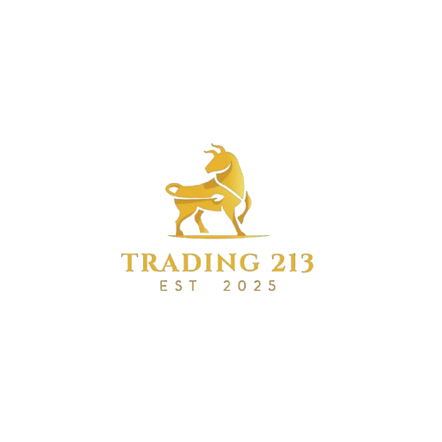

Everything in this folder is related to the MVC program (aka the website).

## Files

 - Controllers/ - Contains all files related to the logic of the program. Controllers are named by the model they handle, for example `ChatController.cs` contains all logic that handles RocketChat within the MVC.
 - Models - All the classes used to run the logic. These are named logically and consistency to be easy to understand.
 - Views - All the frontend code. They are separated into folders to be logical. For example the "Login" folder contains views that contain the html for the login pages.
 - wwwroot - Contains frontend related scripts such as .css files and javascript logic.
 - CommodityTradingApp.csproj, - This is a file auto created by visual studio and is unlikely to ever need being changed.
 - Program.cs - The core startup program, edit this when you need to register a new service or alter something fundamental about the logic that pulls everything together.

