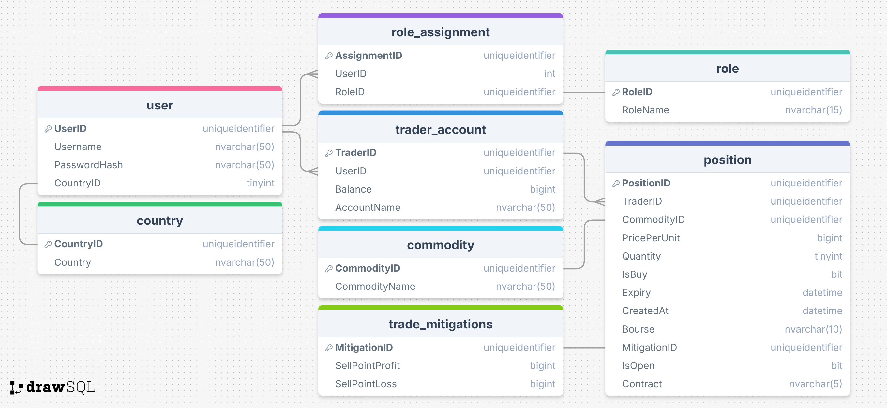
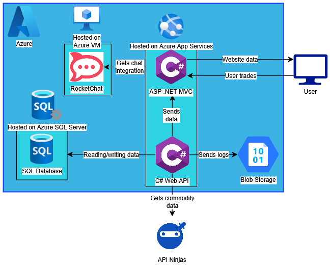



# Trading 213

A project designed to facilitate [paper trading](https://www.investopedia.com/terms/p/papertrade.asp) to allow for hands on experience with the commodities market without risking real capital.

## Description

Practising trading before you risk real capital is always a smart idea! The market is [volatile](https://www.home.saxo/en-gb/content/articles/equities/why-markets-just-got-so-volatile---and-what-it-means-for-investors-07042025) and even experienced traders [cannot beat the market](https://stockanalysis.com/article/can-you-beat-the-market/) and can have [incredible losses](https://en.wikipedia.org/wiki/Archegos_Capital_Management). This is what Trading 213 was designed to help avoid, we give users practical experience trading commodities without risk, you wont earn any money but you will get something better - [knowledge](https://en.wiktionary.org/wiki/give_a_man_a_fish_and_you_feed_him_for_a_day;_teach_a_man_to_fish_and_you_feed_him_for_a_lifetime)

This project consists of two solution files, one is the API which controls most of the logic for trading, running the buying and selling logic, inserting and reading from the database and other technical code. The second solution is the [MVC](https://en.wikipedia.org/wiki/Model%E2%80%93view%E2%80%93controller) which communicates with the API to display to, and handle requests from, users accessing the frontend. This is essentially the "website" whereas the API is "the logic". The code is broken up like this for ease of modification and error handling. In our project we hosted everything on [Microsoft Azure](https://azure.microsoft.com/en-gb) but in theory you could use any other cloud provider with some modification to the code. It can also be run locally as long as both the API and the MVC are run at the same time.

## Contents

- ### [API](./CommodityTradingAPI/README.md)

- ### [MVC](./CommodityTradingApp/README.md)

- ### [Database](./Database/README.md)

- ### [Resources](./Resources/README.md)

## Getting started

This file (and others named README throughout the repo) are designed to explain to fresh eyes how to navigate the code as well as deploy and run the code.

We use [API Ninjas](https://www.api-ninjas.com/) to get data on the commodities for the prices. To use this code you will need an [API token](https://www.api-ninjas.com/pricing) which will cost money (about ). You may also wish to host the application online using the cloud. To do this we used (and thus set the code up for) Microsoft Azure. You will also need a subscription for this.

We also use [RocketChat](https://www.rocket.chat/) integration to run our chatroom. Rocketchat is free but is worth researching if you want to integrate it into your instance.

Before starting with running this project make sure you have a cursory understanding of [APIs](https://en.wikipedia.org/wiki/API) and [MVCs](https://en.wikipedia.org/wiki/Model%E2%80%93view%E2%80%93controller) in case you need to debug any of the code to work for your specific situation. 

## Installing

Firstly you will need to set up a database, we used the Microsoft SQL Server dialect of SQL and relevant files for the database can be found in the [Database](./Database/README.md) folder. Apply the `schema.sql` script to your database to set it up.

As this program is written in C# rather than using a `.env` we use a `appsettings` file to hold sensitive data. The `appsettings` file is essentially a [JSON](https://en.wikipedia.org/wiki/JSON) formatted `.env` file. To run the project open the folder containing it in [visual studio](https://visualstudio.microsoft.com/) and navigate to the [API solution (.sln) file](./CommodityTradingAPI/CommodityTradingAPI/CommodityTradingAPI.sln). Right click the solution (.sln) file in the solution explorer and click `Add New Item...` and find `appsettings` and create the file. Do the same for the [MVC solution file](./CommodityTradingApp/CommodityTradingApp/CommodityTradingApp.sln). Then format the `appsettings` files as so:
```
{
    "JwtSettings": {
        "Key": "[Your encryption key]",
        "Issuer": "[Who you want your issuer to be]",
        "Audience": "[How you want to refer to your audience]",
        "Expiry": [An integer that refers to the number of minutes for the token to expire]
    },
    "Logging": {
        "LogLevel": {
            "Default": "[The lowest level you want logged]",
            "Microsoft.AspNetCore": "Warning"
        }
    },
    "ConnectionStrings": {
        "Default": "[A connection string to your SQL database]",
        "AzureBlobStorage": "[A connection string to where you want your logs outputted]"
    },
    "api": "[Your Trading 213 API link]"
    "LogStorageName": "[The name of your blob storage]",
    "AdminPassword": "[Password you want the default admin user to have]",
    "AllowedHosts": "*",
    "X-Api-Key": "[The APINinjas API key you purchased]",
    "rocket-chat-url": "[URL to your instance of rocket chat]",
    "authToken": "[Your rocketchat authorisation token]",
    "userId": "[Your rocketchat user ID]
}
```

**NOTE**: You will need to remove the "api" section for the `appsettings` in the API solution file.

Once this is done you need to ensure the API is running somewhere. It can be locally or online but make sure the "api" part of the MVC `appsettings` links to your api instance.

Running the MVC now runs the website!

## Useful Diagrams

### ERD:



### Architecture Diagram:



## Authors

* [Candice Bennett](https://github.com/Candice-Bennett)
* [Daniel Camans](https://github.com/DCamans)
* [Shabrina Hoque](https://github.com/anisahhoque)
* [Joseph McGowan](https://github.com/Joseph-McGowan)
* [Haroon Qasim](https://github.com/haroon-101)
* [Matt Severn](https://github.com/matt-severnsl)
